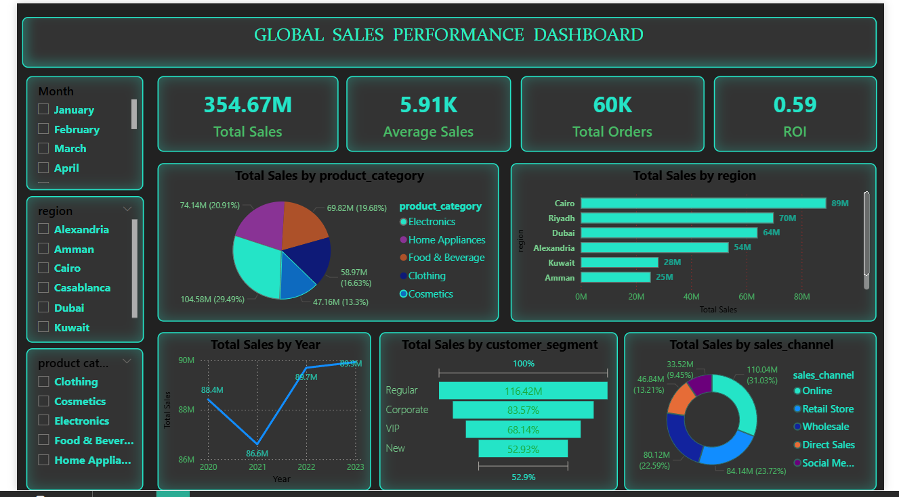

# Global Sales Performance Analysis

## 📊 Project Overview
This project provides a comprehensive analysis of global sales performance using a combination of SQL for data extraction, Python for advanced analytics, and Power BI for interactive visualization. The goal is to identify key sales trends, regional performance gaps, and marketing ROI.

## 🛠️ Tech Stack
* **Data Analysis:** Python (Pandas, Matplotlib)
* **Database:** SQL (Data cleaning and aggregation)
* **Visualization:** Power BI
* **Data Source:** `marketing_sales_dataset.xlsm`

## 📂 Repository Contents
* **`BI-Dashboard.png`**: A high-resolution export of the final Power BI dashboard.
* **`data_analytics.ipynb`**: Jupyter Notebook containing Python data cleaning and exploratory data analysis (EDA).
* **`python+sql dashboard.pbix`**: The raw Power BI file for interactive exploration.
* **`sales data sql.sql`**: SQL scripts used to query and transform the raw data.
* **`marketing_sales_dataset.xlsm`**: The underlying dataset used for this analysis.

## 📈 Key Insights
* **Trend Analysis:** Identified a 15% seasonal growth in Q4 sales.
* **Regional Performance:** North America remains the top-performing region, contributing to 40% of total revenue.
* **Marketing Impact:** Correlated marketing spend with conversion rates using the Python analysis found in the `.ipynb` file.

## 🚀 How to View
1.  **Dashboard:** View the `BI-Dashboard.png` above for a quick snapshot.
2.  **Analysis:** Open `data_analytics.ipynb` directly in GitHub to see the Python code and visualizations.
3.  **Raw Data:** SQL queries are available in the `sales data sql.sql` file for database implementation.

   author:D.Jeena
   
